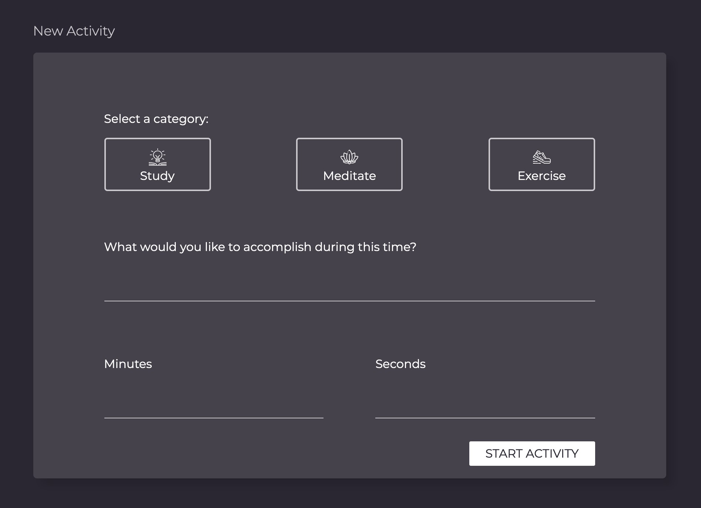
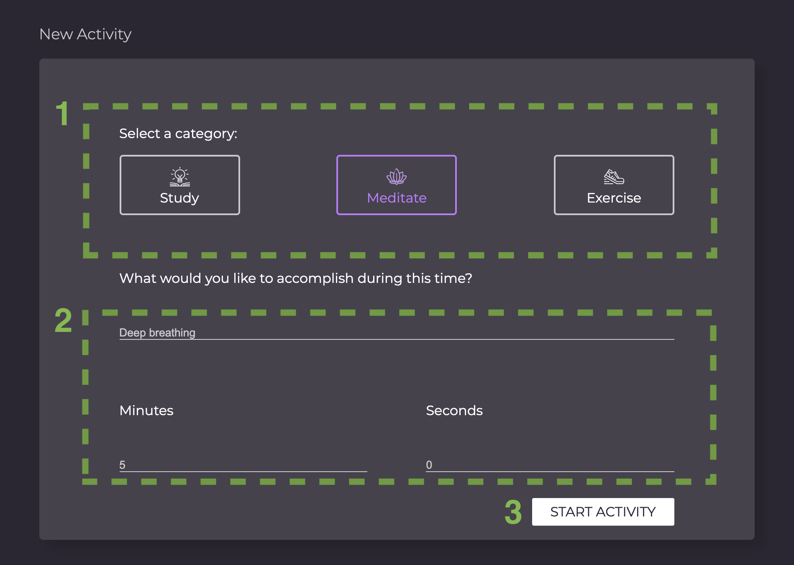
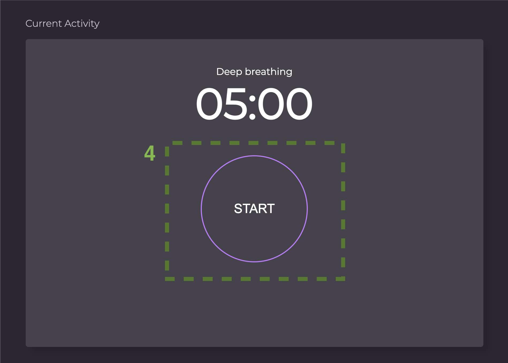
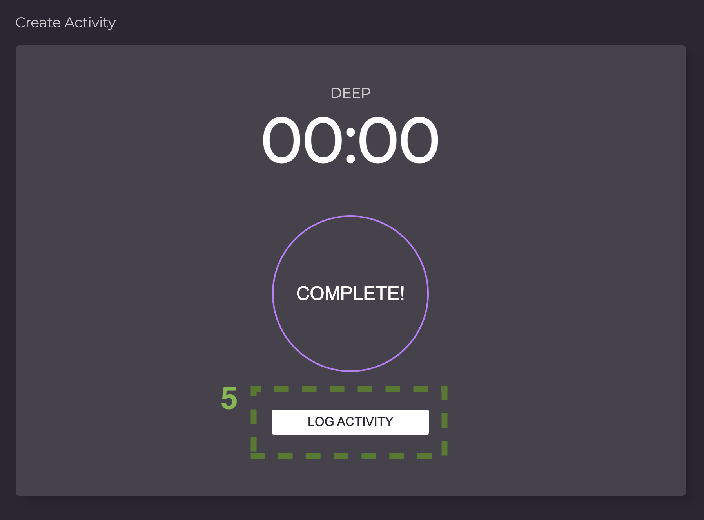
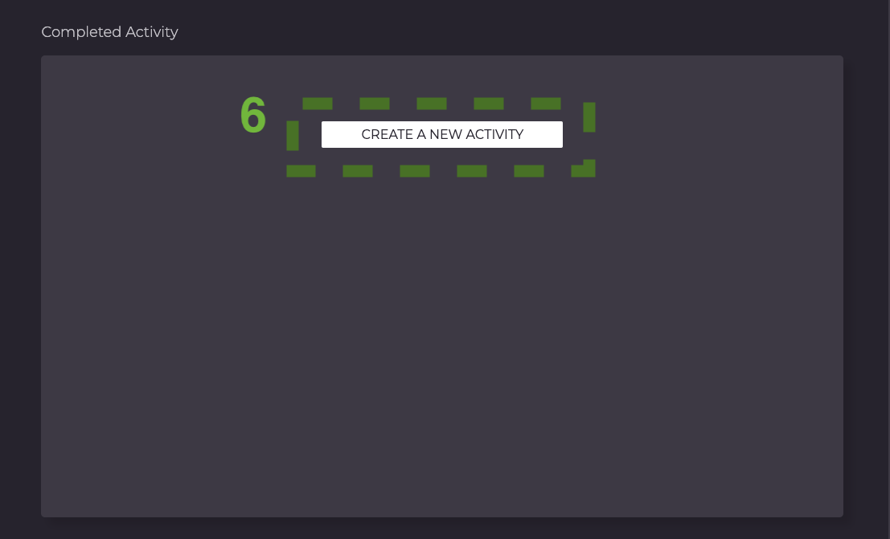

# INTENTION TIMER

## Introduction   
Intention timer is a tool for setting goals and reflecting on progress. It provides three categories of activities to track and allows users to input a specific goal and time for each activity. A list of completed activities gives the user the change reflect on their accomplishments.

## Using the App
1. Select one of the three activities.
2. Set a goal and time for your activity.
3. Click ‘START ACTIVITY’.

_When the page updates, the current goal and time appears onscreen along with a start button._

4. Push the ‘START’ button to begin the countdown.

_Focus on your intention while the timer runs down._

5. Push ‘LOG ACTIVITY’ to save your completed activity.

_Saved activities will appear on the right of the screen_

6. Push ‘CREATE A NEW ACTIVITY’ to return to the home screen and set a new intention.

## Link to the deployed set
https://github.com/rdtho2525/intention-timer

## Local install instructions
1. Clone this repo
2. CD into the intention-timer directory
3. Open index.html in your browser

## Contributors
 * Reggie Thompson https://github.com/rdtho2525
 * Matt Umland https://github.com/mattumland
_We hope our timer brings you joy._
